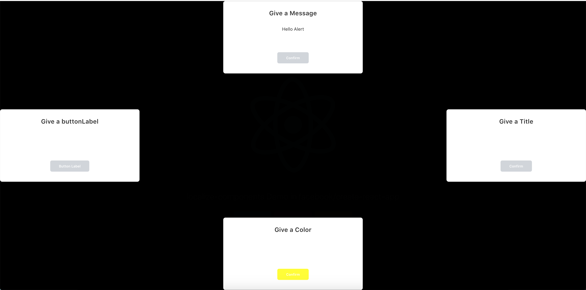

# Localize React Components

[](https://circleci.com/gh/Seolhun/localize-components/tree/master) 
[](https://www.codacy.com/app/shun10114/localize-components?utm_source=github.com&amp;utm_medium=referral&amp;utm_content=Seolhun/localize-components&amp;utm_campaign=Badge_Grade)
[](https://codebeat.co/projects/github-com-seolhun-localize-components-master)
[](https://lernajs.io/)

- Author : [HunSeol](https://github.com/Seolhun/)

## Used stacks
- React
- TypeScript
- SCSS
- Storybook

## Getting start
#### Install Package
```bash
$ yarn add @seolhun/localize-components styled-components
$ yarn add @seolhun/localize-components-atomic
```

## How to use
#### import
```js
import { Alert } from '@seolhun/localize-components';
import { Button } from '@seolhun/localize-components-atomic';
```


## Test using [facebook/create-react-app](https://github.com/facebook/create-react-app)
```jsx
import React, { Component } from 'react';
import logo from './logo.svg';
import './App.css';

import { Button } from '@seolhun/localize-components-atomic';
import { Alert } from '@seolhun/localize-components';

class App extends Component {
	state = {
		isShow: false,
	}

	handleIsShow = () => {
		this.setState(({ isShow }) => {
			return {
				isShow: !isShow,
			}
		})
	}

  render() {
		const { isShow } = this.state;

    return (
      <div className="App">
        <header className="App-header">
          
          <p>
            localize-components Demo in facebook/create-react-app
          </p>
          <a
            className="App-link"
            href="https://reactjs.org"
            target="_blank"
            rel="noopener noreferrer"
          >
						<Button className='btn btn-primary'>
	            Learn React
						</Button>
						<Button className='btn btn-danger'>
	            Learn React
						</Button>
						<Button className='btn btn-warning'>
	            Learn React
						</Button>
          </a>
					{!isShow && (
						<Button
							className='btn btn-outline-success'
							onClick={this.handleIsShow}
						>
							Show Alert
						</Button>
					)}
					<Alert
						title='Give a Title'
						isShow={this.state.isShow}
						position='right'
						onClickClose={this.handleIsShow}
					/>
					<Alert
						title='Give a Message'
						message='Hello Alert'
						isShow={this.state.isShow}
						position='top-center'
						onClickClose={this.handleIsShow}
					/>
					<Alert
						title='Give a buttonLabel'
						buttonLabel='Button Label'
						isShow={this.state.isShow}
						position='left'
						onClickClose={this.handleIsShow}
					/>
					<Alert
						title='Give a Color'
						color='yellow'
						isShow={this.state.isShow}
						position='bottom-center'
						onClickClose={this.handleIsShow}
					/>
        </header>
      </div>
    );
  }
}

export default App;
```



