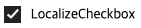
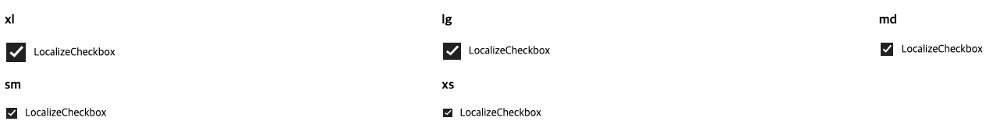
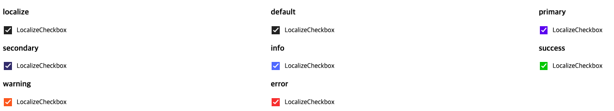
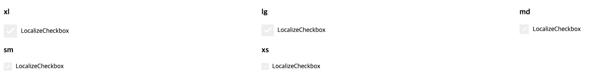

# LocalizeCheckbox

### Table of contents

- Anatomy
- Options
- Behaviors
- Accessibility
- Theme
- Design checklist

### Options

- Internationalization
- Use cases

---

## 1. Anatomy & Specs




## 2. Options

### Label

- 체크 박스에는 항상 라벨이 있어야합니다.
- 라벨을 정의하지 않고 사용하고 싶으면 LocalizeFormItem과 같이 사용하길 권장하며 혹은 Switch를 권장합니다.

### Size



- 체크박스 사이즈는 'xs' | 'sm' | 'md' | 'lg' | 'xl' 존재합니다.
- 자주 사용되는 size는 md이며, 이를 기본 값으로 사용합니다.
- 체크박스 간의 다른 크기는 조금만 사용하세요. 페이지 내에서 중요한 계층을 만드는 데 사용해야합니다.

### Intent



- 체크박스 intent는 `localize`, `default` | `primary` | `secondary` | `success` | `info` | `warning` | `error` 존재합니다.
- 자주 사용되는 intent는 primary이며, 이를 기본 값으로 사용합니다.
- intent는 주로 계층과 상태를 나타내며, 강조할 떄는 primary를 사용합니다.

### Disabled



- 비활성화 된 상태의 체크박스은 작업이 존재하지만 해당 상황에서 사용할 수 없음을 나타냅니다.
- 이 상태는 레이아웃 연속성을 유지하고 나중에 작업을 사용할 수 있음을 알리는 데 사용할 수 있습니다.

## 3. Props

```tsx
  /**
   * Set this to change label
   */
  children?: React.ReactNode;

  /**
   * Set this to change size
   * @default md
   */
  size?: 'xs' | 'sm' | 'md' | 'lg' | 'xl';

  /**
   * Set this to change intent
   * @default default
   */
  intent?: 'localize' | 'default' | 'primary' | 'secondary' | 'success' | 'info' | 'warning' | 'error';

  /**
   * Set this to change variant
   */
  disabled?: boolean;
```

## 4. Behaviors

- All interactive states
  - Includes all interactive states that are applicable (hover, down, focus, keyboard focus, disabled).

## 5. Accessibility

- 미작성/추후 예정

## 6. Design checklist

- [ ] All color themes
  - Works properly across all four color themes (light, dark).
- [ ] All platform scales
  - Includes a desktop scale (UWP, macOS, web desktop) and a mobile scale (iOS, Android, web mobile).
- [ ] All interactive states
  - Includes all interactive states that are applicable (hover, down, focus, keyboard focus, disabled).
- [ ] Defined behaviors
  - Includes guidelines for layout (wrapping, truncation, overflow), animation, interactions, etc.
- [ ] Keyboard interactions
  - Follows WCAG 2.0 standards for keyboard accessibility guidelines and includes a description of the keyboard interactions.

## 7. Internationalization

- 미정/추후 예정

## 8. Use cases

- 미정/추후 예정

---

## References

- [https://spectrum.adobe.com/page/checkbox/](https://spectrum.adobe.com/page/checkbox/)
- [https://material.io/components/checkboxes](https://material.io/components/checkboxes)
- [https://chakra-ui.com/docs/form/checkbox](https://chakra-ui.com/docs/form/checkbox)
- [https://blueprintjs.com/docs/#core/components/checkbox](https://blueprintjs.com/docs/#core/components/checkbox)
- [https://evergreen.segment.com/components/checkbox](https://evergreen.segment.com/components/checkbox)
- [https://ant.design/components/checkbox/](https://ant.design/components/checkbox/)
